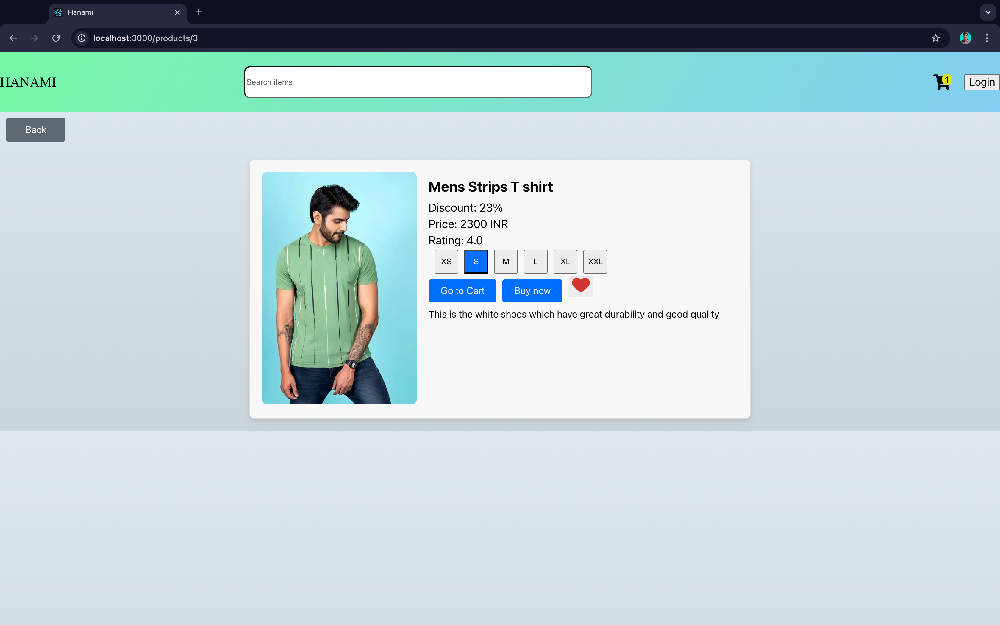
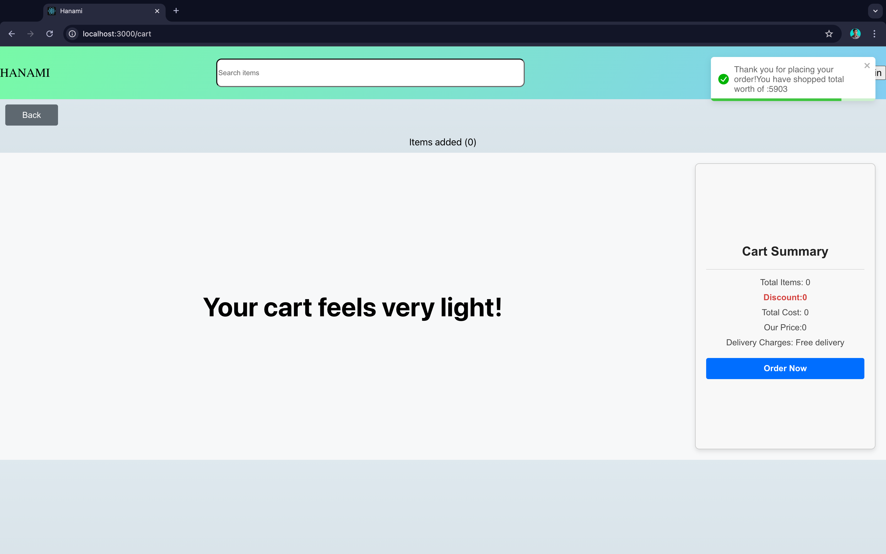
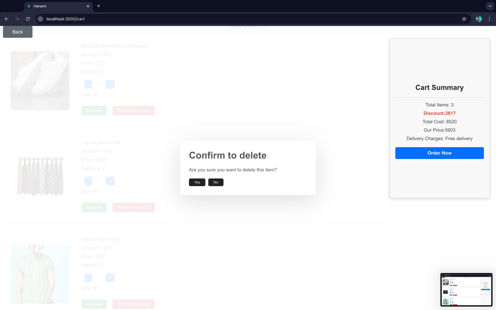
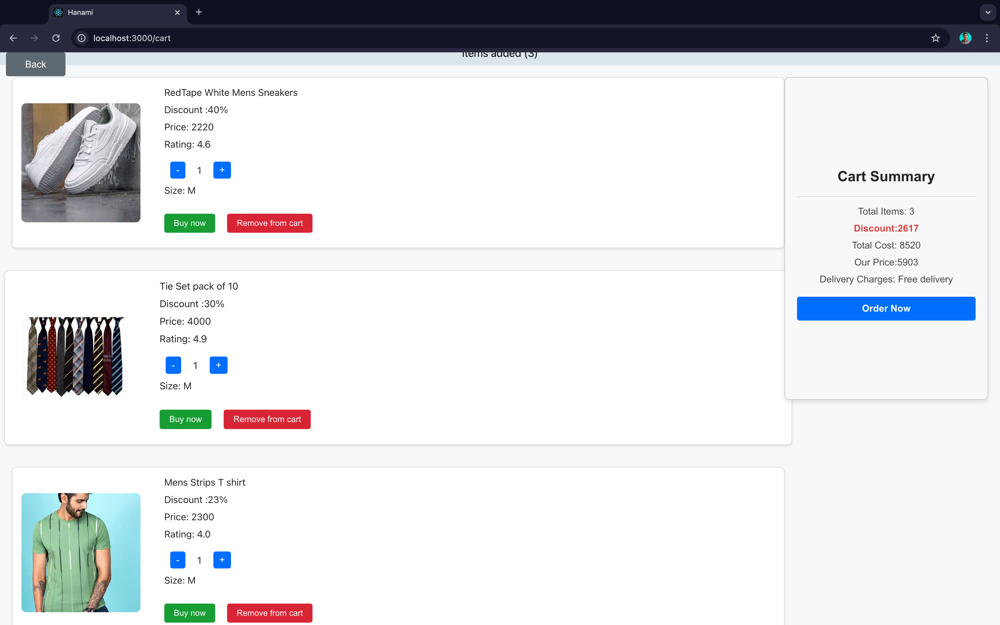

## Hanami Clothing store

Welcome to Hanami, an online clothing store that offers a wide selection of fashion items for all occasions. Whether you're looking for casual wear, formal attire, or the latest trends, Hanami has something for everyone. We are currently running exclusive offers on selected products, so don't miss out on the chance to refresh your wardrobe at unbeatable prices.

## Table of Contents
- [Features]
- [Installation]
- [Install-dependencies]
- [Usage]

## Features

1. Dynamic Data Integration
    Dynamic Product Data: The website uses dynamic data for products, fetched from either third-party APIs or custom-built APIs.
    Individual Product Page: Clicking on a product card on the homepage will navigate users to a detailed individual product page.
2. Individual Product Page
    Size Selection: Users can select sizes (XS, S, M, L, XL, XXL) for products that are in stock. The size options are disabled for out-of-stock products.
    Wishlist Functionality:
      Users can add or remove products to/from their wishlist, regardless of stock status.
      Wishlist status is maintained across the homepage and individual product pages.
    Add to Cart:
      Users can add products to their cart. If the product is already in the cart, the quantity will be increased.
      The "Add to Cart" button transforms into a "Go to Cart" button after the product is added.
      The "Go to Cart" button navigates users to the cart page.
      The button is disabled for out-of-stock products.
3. Cart Page
      Cart Navigation: Clicking the cart icon in the navbar navigates to the cart page.
    Remove from Cart:
      Clicking "Remove from Cart" triggers a pop-up confirmation with "Yes" and "No" options.
      Selecting "Yes" removes the product; selecting "No" retains the current quantity.
      If quantity becomes zero, a confirmation pop-up asks whether to remove the item.
    Quantity Management: Users can increase or decrease the quantity of products in their cart. The total amount updates accordingly.
    Order Now:
     Clicking "Order Now" displays a toast message with the total amount and a thank you message.
     The cart is cleared after placing an order.
      If the cart is empty, a message saying "Your cart feels very light! 🥺" is shown.

## Installation

## Description
1. This Project Contains the products of Hanami Store where it has Offer Products and Non-Offer Products
2. In this project I have implimented the Add to cart, Wish list, Search and Cart Functionalities.
3

1. Clone the repository:
    git clone https://github.com/vinaysaieverest/React_Assignment_Task_3

2. Install-dependencies:
    npm install

3. Usage:
npm start

# UI

